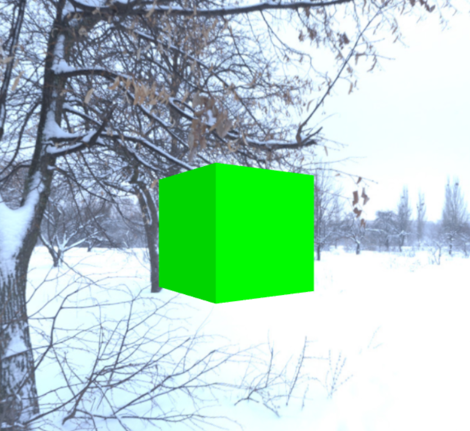

# Snowscape in Three.js

This is just a little playing around with Three.js to create a landscape with terrain. 

## To Do

I currently am trying to place a plane with texture within a skybox that looks appropriate and with appropriate lighting. 